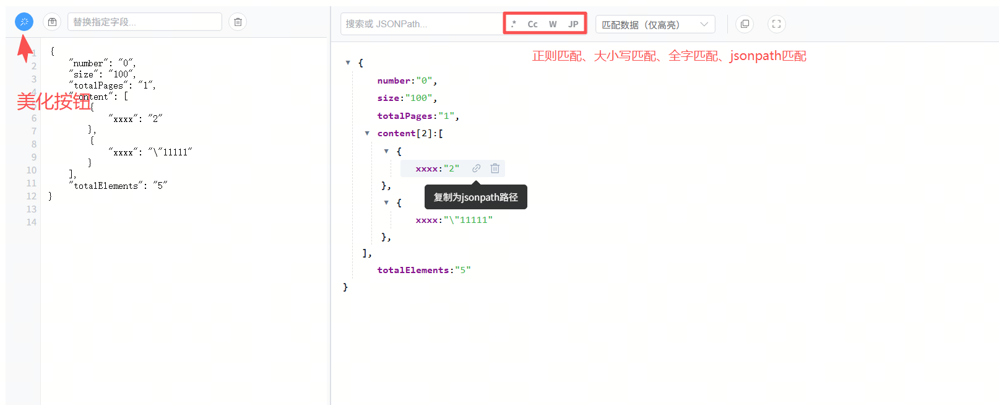
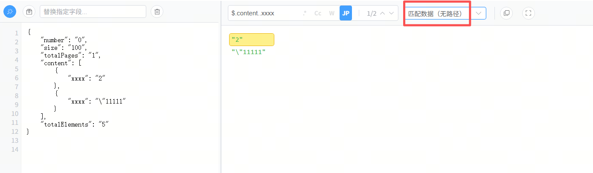
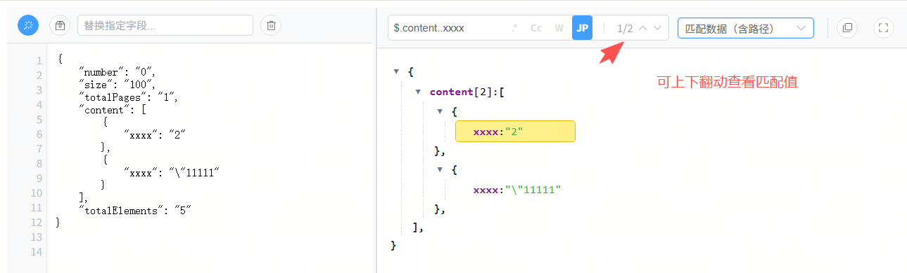
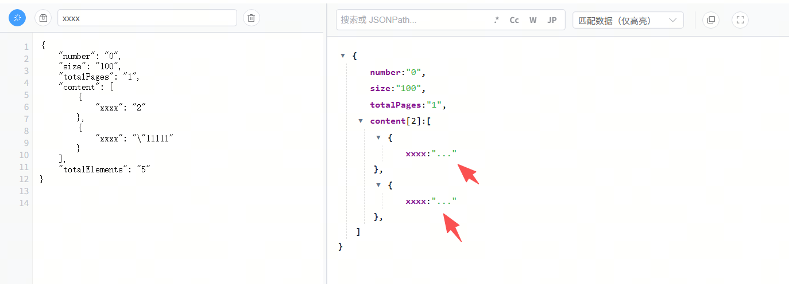

# json_view
在线的一款好用json格式化工具

访问地址:
https://floweroda.github.io/json_view/

注意：如果选了JP模式是一定需要在检索框输入值的,否则点击美化按钮无效
# 功能
- 支持jsonpath检索和路径复制
- 支持正则、大小写、全字匹配检索
- 支持删除节点
- 支持 匹配数据多种显示方式
- 支持将部分超长字段替换为...











如果想要私有部署 请安装`python3.8+ `
新建`front`文件夹，然后将`index.html`和`assets`目录都移动到`front`,在启动python脚本即可

```bash
pip install flask
python app.py
```
